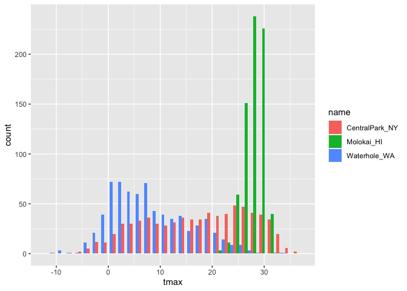

Viz and EDA 1
================
Sarah Haberlack
2023-09-28

``` r
library(tidyverse)
```

    ## ── Attaching core tidyverse packages ──────────────────────── tidyverse 2.0.0 ──
    ## ✔ dplyr     1.1.2     ✔ readr     2.1.4
    ## ✔ forcats   1.0.0     ✔ stringr   1.5.0
    ## ✔ ggplot2   3.4.3     ✔ tibble    3.2.1
    ## ✔ lubridate 1.9.2     ✔ tidyr     1.3.0
    ## ✔ purrr     1.0.2     
    ## ── Conflicts ────────────────────────────────────────── tidyverse_conflicts() ──
    ## ✖ dplyr::filter() masks stats::filter()
    ## ✖ dplyr::lag()    masks stats::lag()
    ## ℹ Use the conflicted package (<http://conflicted.r-lib.org/>) to force all conflicts to become errors

``` r
library(ggridges)
```

knitr::opts_chunk\$set( fig.width = .6, fig.asp = .6, out.width = “90%”
)

Get the data for plotting today.

``` r
weather_df = 
  rnoaa::meteo_pull_monitors(
    c("USW00094728", "USW00022534", "USS0023B17S"),
    var = c("PRCP", "TMIN", "TMAX"), 
    date_min = "2021-01-01",
    date_max = "2022-12-31") |>
  mutate(
    name = recode(
      id, 
      USW00094728 = "CentralPark_NY", 
      USW00022534 = "Molokai_HI",
      USS0023B17S = "Waterhole_WA"),
    tmin = tmin / 10,
    tmax = tmax / 10) |>
  select(name, id, everything())
```

    ## using cached file: /Users/sarahhaberlack/Library/Caches/org.R-project.R/R/rnoaa/noaa_ghcnd/USW00094728.dly

    ## date created (size, mb): 2023-09-28 10:18:28.029499 (8.524)

    ## file min/max dates: 1869-01-01 / 2023-09-30

    ## using cached file: /Users/sarahhaberlack/Library/Caches/org.R-project.R/R/rnoaa/noaa_ghcnd/USW00022534.dly

    ## date created (size, mb): 2023-09-28 10:18:34.386055 (3.83)

    ## file min/max dates: 1949-10-01 / 2023-09-30

    ## using cached file: /Users/sarahhaberlack/Library/Caches/org.R-project.R/R/rnoaa/noaa_ghcnd/USS0023B17S.dly

    ## date created (size, mb): 2023-09-28 10:18:37.975504 (0.994)

    ## file min/max dates: 1999-09-01 / 2023-09-30

Let’s make a plot!

``` r
ggplot(weather_df, aes(x = tmin, y = tmax)) +
  geom_point()
```

    ## Warning: Removed 17 rows containing missing values (`geom_point()`).

<!-- -->

Pipes and stuff sh: you’re saying “start with this df, then do something
else” sh: save as a new df to condense your code, or to save plots.

``` r
weather_df |>
  filter(name == "CentralPark_NY") |>
  ggplot(aes(x = tmin, y = tmax)) +
  geom_point()
```

<!-- -->

``` r
ggp_nyc_weather =
  weather_df |>
  filter(name == "CentralPark_NY") |>
  ggplot(aes(x = tmin, y = tmax)) +
  geom_point()
```

## Fancy plot

``` r
ggplot(weather_df, aes(x = tmin, y = tmax, color = name)) +
  geom_point() +
  geom_smooth()
```

    ## `geom_smooth()` using method = 'loess' and formula = 'y ~ x'

    ## Warning: Removed 17 rows containing non-finite values (`stat_smooth()`).

    ## Warning: Removed 17 rows containing missing values (`geom_point()`).

<!-- -->

Changing where the color is. In the below graph, only the points will be
highlighted by color and the smooth line is not.

``` r
ggplot(weather_df, aes(x = tmin, y = tmax)) +
  geom_point(aes(color = name)) +
  geom_smooth()
```

    ## `geom_smooth()` using method = 'gam' and formula = 'y ~ s(x, bs = "cs")'

    ## Warning: Removed 17 rows containing non-finite values (`stat_smooth()`).

    ## Warning: Removed 17 rows containing missing values (`geom_point()`).

<!-- -->

Taking away the points and just keeping the smooth line (practically,
not a great idea but it is possible to do.)

``` r
ggplot(weather_df, aes(x = tmin, y = tmax)) +
  geom_smooth(se = FALSE)
```

    ## `geom_smooth()` using method = 'gam' and formula = 'y ~ s(x, bs = "cs")'

    ## Warning: Removed 17 rows containing non-finite values (`stat_smooth()`).

<!-- -->

Only in geom point, make 70% opaque and 30% solid.

``` r
ggplot(weather_df, aes(x = tmin, y = tmax)) +
  geom_point(aes(color = name), alpha= 0.3) +
  geom_smooth()
```

    ## `geom_smooth()` using method = 'gam' and formula = 'y ~ s(x, bs = "cs")'

    ## Warning: Removed 17 rows containing non-finite values (`stat_smooth()`).

    ## Warning: Removed 17 rows containing missing values (`geom_point()`).

<!-- -->

``` r
ggplot(weather_df, aes(x = tmin, y = tmax, color = name)) +
  geom_point(alpha = 0.3) +
  geom_smooth() +
  facet_grid(. ~ name)
```

    ## `geom_smooth()` using method = 'loess' and formula = 'y ~ x'

    ## Warning: Removed 17 rows containing non-finite values (`stat_smooth()`).

    ## Warning: Removed 17 rows containing missing values (`geom_point()`).

<!-- -->

^ dot says “put everything on this row” and facet by name. automatically
outputs based on alphabetical order of facets.

Let’s try a different plot. Temps are boring. Over that two-year period,
what’s the average temperature?

``` r
ggplot(weather_df, aes(x = date, y = tmax, color = name)) +
  geom_point(aes(size = prcp), alpha = 0.3) +
  geom_smooth() +
  facet_grid(. ~ name)
```

    ## `geom_smooth()` using method = 'loess' and formula = 'y ~ x'

    ## Warning: Removed 17 rows containing non-finite values (`stat_smooth()`).

    ## Warning: Removed 19 rows containing missing values (`geom_point()`).

<!-- -->

Try assigning a specific color (JG almost never sets color by hand in
this way. )

``` r
weather_df |>
  filter(name == "CentralPark_NY") |>
  ggplot(aes(x = date, y = tmax)) +
  geom_point(color = "blue", size = .5)  
```

<!-- -->

hex plot

``` r
weather_df |>
  ggplot(aes(x = tmin, y = tmax)) +
  geom_hex()
```

    ## Warning: Removed 17 rows containing non-finite values (`stat_binhex()`).

<!-- -->

line plot

``` r
weather_df |>
  filter(name == "Molokai_HI") |>
  ggplot(aes(x = date, y = tmax)) +
  geom_line(alpha = 0.5) +
  geom_point(alpha = 0.5)
```

    ## Warning: Removed 1 rows containing missing values (`geom_point()`).

<!-- -->

## Univariate plotting

Histogram

``` r
ggplot(weather_df, aes(x = tmax, fill = name)) +
  geom_histogram(position = "dodge")
```

    ## `stat_bin()` using `bins = 30`. Pick better value with `binwidth`.

    ## Warning: Removed 17 rows containing non-finite values (`stat_bin()`).

<!-- -->

dodge bames the bars “avoid” each other instead of stacking on top of
each other. but this looks confusing. to compare all this data, we’d
rather just not use a histogram anymore to convey this data.

let’s use a density plot.

``` r
ggplot(weather_df, aes(x = tmax, fill = name)) +
  geom_density(alpha = 0.3, adjust = .5)
```

    ## Warning: Removed 17 rows containing non-finite values (`stat_density()`).

<!-- -->

In a density plot, adjust” makes everything a little LESS smooth \< 1
and more smooth \> 1.

We can compare univariate distributions also by using BOXPLOTS.

``` r
ggplot(weather_df, aes(y = tmax, x = name)) +
  geom_boxplot()
```

    ## Warning: Removed 17 rows containing non-finite values (`stat_boxplot()`).

<!-- -->

Violin plots?

``` r
ggplot(weather_df, aes(y = tmax, x = name)) +
  geom_violin()
```

    ## Warning: Removed 17 rows containing non-finite values (`stat_ydensity()`).

<!-- -->

ridge plot

``` r
ggplot(weather_df, aes(x = tmax, y = name)) +
  geom_density_ridges()
```

    ## Picking joint bandwidth of 1.54

    ## Warning: Removed 17 rows containing non-finite values
    ## (`stat_density_ridges()`).

<!-- -->

^Quick way of looking at, e.g., 50 states at a time

## saving and embedding plots

``` r
ggp_weather =
  weather_df |>
  ggplot(aes(x = tmin, y = tmax)) +
  geom_point()

ggp_weather
```

    ## Warning: Removed 17 rows containing missing values (`geom_point()`).

<!-- -->

``` r
ggsave("results/ggp_weather.pdf", ggp_weather)
```

    ## Saving 7 x 5 in image

    ## Warning: Removed 17 rows containing missing values (`geom_point()`).

When we knit, the plots become embedded into this document. We ask, is
this the right size? etc? R is making automatic rescaling choices.

To change the scale of the plot being made,:

``` r
ggp_weather
```

    ## Warning: Removed 17 rows containing missing values (`geom_point()`).

<!-- -->

fig.asp is “aspect ratio” in relation to the width
