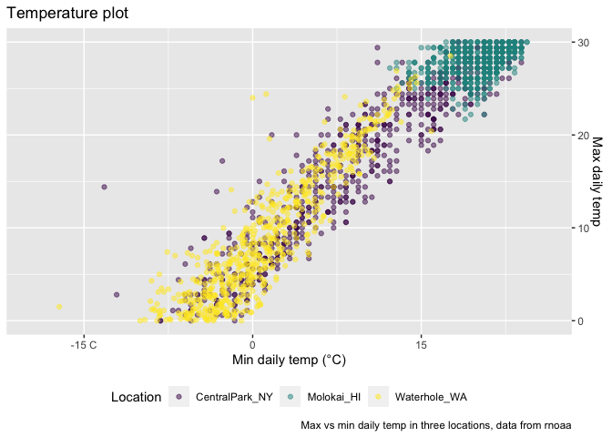
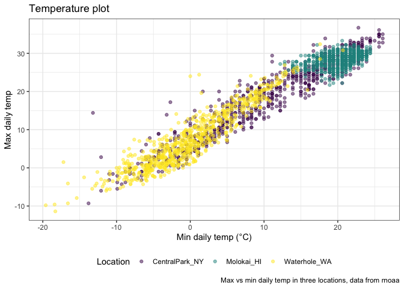

Viz part 2
================
Sarah Haberlack
2023-10-03

``` r
library(tidyverse)
```

    ## ── Attaching core tidyverse packages ──────────────────────── tidyverse 2.0.0 ──
    ## ✔ dplyr     1.1.2     ✔ readr     2.1.4
    ## ✔ forcats   1.0.0     ✔ stringr   1.5.0
    ## ✔ ggplot2   3.4.3     ✔ tibble    3.2.1
    ## ✔ lubridate 1.9.2     ✔ tidyr     1.3.0
    ## ✔ purrr     1.0.2     
    ## ── Conflicts ────────────────────────────────────────── tidyverse_conflicts() ──
    ## ✖ dplyr::filter() masks stats::filter()
    ## ✖ dplyr::lag()    masks stats::lag()
    ## ℹ Use the conflicted package (<http://conflicted.r-lib.org/>) to force all conflicts to become errors

``` r
knitr::opts_chunk$set(
  fig.width = .6,
  fig.asp = .6,
  out.width = "90%"
)
```

Get the data for plotting today.

``` r
weather_df = 
  rnoaa::meteo_pull_monitors(
    c("USW00094728", "USW00022534", "USS0023B17S"),
    var = c("PRCP", "TMIN", "TMAX"), 
    date_min = "2021-01-01",
    date_max = "2022-12-31") |>
  mutate(
    name = recode(
      id, 
      USW00094728 = "CentralPark_NY", 
      USW00022534 = "Molokai_HI",
      USS0023B17S = "Waterhole_WA"),
    tmin = tmin / 10,
    tmax = tmax / 10) |>
  select(name, id, everything())
```

    ## using cached file: /Users/sarahhaberlack/Library/Caches/org.R-project.R/R/rnoaa/noaa_ghcnd/USW00094728.dly

    ## date created (size, mb): 2023-09-28 10:18:28.029499 (8.524)

    ## file min/max dates: 1869-01-01 / 2023-09-30

    ## using cached file: /Users/sarahhaberlack/Library/Caches/org.R-project.R/R/rnoaa/noaa_ghcnd/USW00022534.dly

    ## date created (size, mb): 2023-09-28 10:18:34.386055 (3.83)

    ## file min/max dates: 1949-10-01 / 2023-09-30

    ## using cached file: /Users/sarahhaberlack/Library/Caches/org.R-project.R/R/rnoaa/noaa_ghcnd/USS0023B17S.dly

    ## date created (size, mb): 2023-09-28 10:18:37.975504 (0.994)

    ## file min/max dates: 1999-09-01 / 2023-09-30

## Same plot from last time

Adding labels (“labs”)

``` r
weather_df |> 
  ggplot(aes(x = tmin, y = tmax, color = name)) +
  geom_point(alpha = .5) +
  labs(
    title = "Temperature plot",
    x = "Min daily temp (°C)",
    y = "Max daily temp",
    color = "Location",
    caption = "Max vs min daily temp in three locations, data from rnoaa"
  )
```

    ## Warning: Removed 17 rows containing missing values (`geom_point()`).



Now, let’s play with scale. Default is good, but there are other options
that you might sometimes want to use instead. Scales modify the default
mapping between the variable and the aesthetic it’s mapped onto. Note:
We can also “sqrt” transform the data using `trans = "sqrt"` within the
`scale_y_continuous` command. It is sometimes easier to look at some
data if it’s transformed. You could also do this in the mutate function
if you want.

``` r
weather_df |> 
  ggplot(aes(x = tmin, y = tmax, color = name)) +
  geom_point(alpha = .5) +
  labs(
    title = "Temperature plot",
    x = "Min daily temp (°C)",
    y = "Max daily temp",
    color = "Location",
    caption = "Max vs min daily temp in three locations, data from rnoaa"
  ) +
  scale_x_continuous(
    breaks = c(-15, 0, 15),
    labels = c("-15 C", "0", "15")
  ) +
  scale_y_continuous(
    position = "right",
    limits = c(0,30)
  )
```

    ## Warning: Removed 302 rows containing missing values (`geom_point()`).


what about colors … for colors, continuous color options and discrete
color options. for categorical variables (not ordinal), `hue` works. but
it’s gross!

``` r
weather_df |> 
  ggplot(aes(x = tmin, y = tmax, color = name)) +
  geom_point(alpha = .5) +
  labs(
    title = "Temperature plot",
    x = "Min daily temp (°C)",
    y = "Max daily temp",
    color = "Location",
    caption = "Max vs min daily temp in three locations, data from rnoaa"
  ) + 
  viridis::scale_color_viridis(discrete = TRUE)
```

    ## Warning: Removed 17 rows containing missing values (`geom_point()`).



## Themes
